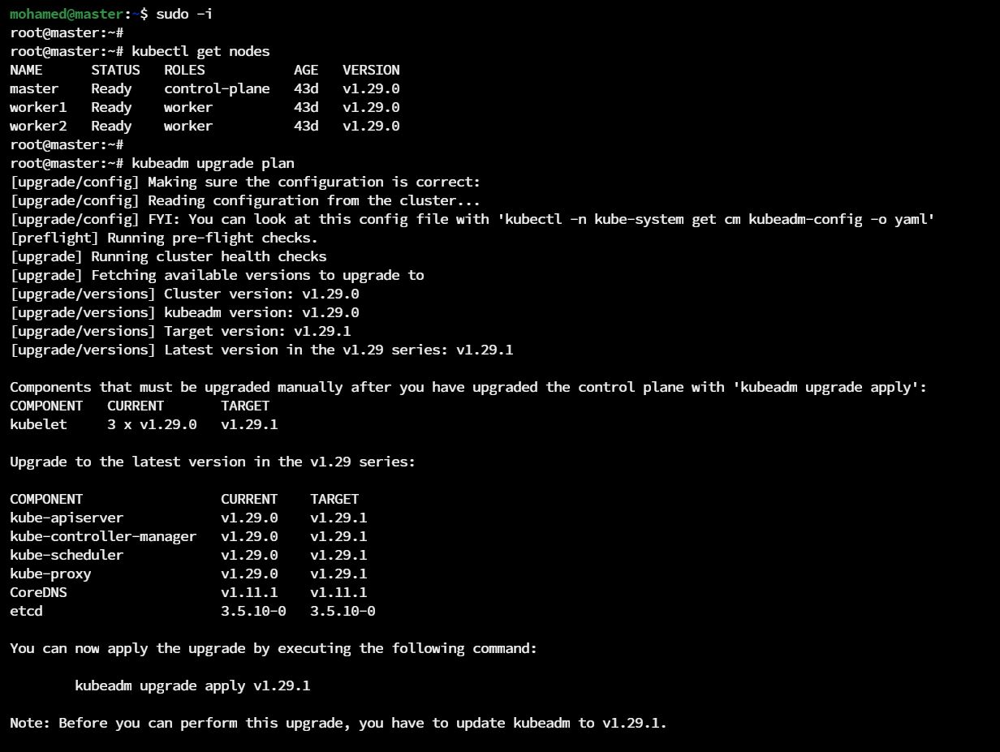
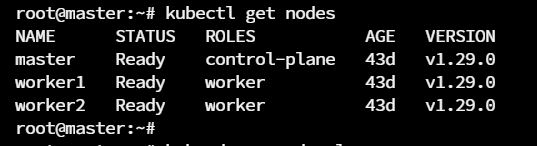
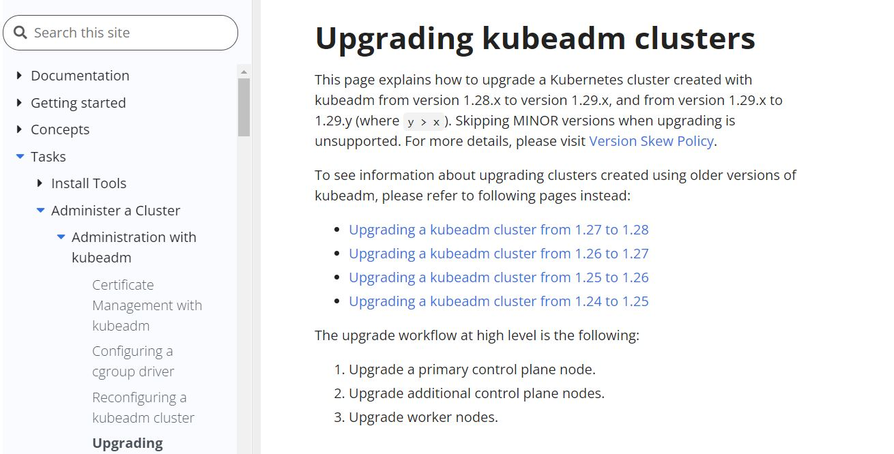

[![LinkedIn][linkedin-shield]][linkedin-url]

<!-- PROJECT LOGO -->
 

  
  <h3 align="center">Upgrading a Kubernetes Cluster</h3>

<!-- TABLE OF CONTENTS -->

  
Table of Contents

  <ol>
    <li><a href="#about-the-project">About The Project</a></li>
    <li><a href="#introduction">Introduction</li>
    <li>
        <a href="#steps">Steps</a>
        <ul>
            <li><a href="#master-node-steps">Master Node Steps</a></li>
            <li><a href="#worker-node-steps">Worker Node Steps</a></li>
      </ul>
    </li>
    <li><a href="#contact">Contact</a></li>
    <li><a href="#references">References</a></li>
  </ol>

<!-- ABOUT THE PROJECT -->
## About The Project

* Project Name: Upgrading a Kubernetes Cluster
* Version: v1.0.0
* Organization Department: Technology

## Introduction

In this project, I've documented upgrading a Kubernetes cluster from v1.29.0 to v1.29.1.

(<a href="#readme-top">back to top</a>)

## Steps

### Master Node Steps

1. Check available nodes and their current version. We can see that the cluster has one master node and two worker nodes. All of them are running v1.29.0

2. Open the documentation page of <a href="https://kubernetes.io/docs/tasks/administer-cluster/kubeadm/kubeadm-upgrade/">Upgrading kubeadm clusters</a>.

3. 

(<a href="#readme-top">back to top</a>)

<!-- CONTACT -->
## Contact

Mohamed AbdelGawad Ibrahim - [@m-abdelgawad](https://www.linkedin.com/in/m-abdelgawad/) - <a href="tel:+201069052620">+201069052620</a>

(<a href="#readme-top">back to top</a>)

## References

* 

(<a href="#readme-top">back to top</a>)

<!-- MARKDOWN LINKS & IMAGES -->
<!-- https://www.markdownguide.org/basic-syntax/#reference-style-links -->
[linkedin-shield]: https://img.shields.io/badge/-LinkedIn-black.svg?style=for-the-badge&logo=linkedin&colorB=555
[linkedin-url]: https://www.linkedin.com/in/m-abdelgawad/
