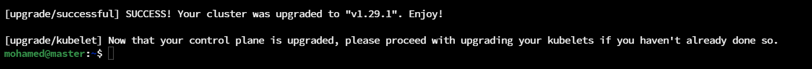
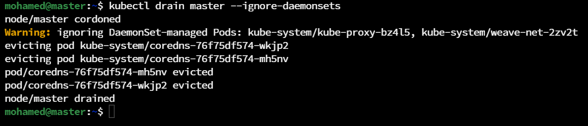

<a name="readme-top"></a>

[![LinkedIn][linkedin-shield]][linkedin-url]


<!-- PROJECT LOGO -->
<br />
<div align="center">
  
  <h3 align="center">Upgrading a Kubernetes Cluster</h3>
</div>


<!-- TABLE OF CONTENTS -->
<details>
  <summary>Table of Contents</summary>
  <ol>
    <li><a href="#about-the-project">About The Project</a></li>
    <li><a href="#introduction">Introduction</li>
    <li>
        <a href="#steps">Steps</a>
        <ul>
            <li><a href="#initial-steps">Initial Steps</a></li>
            <li><a href="#master-node-steps">Master Node Steps</a></li>
            <li><a href="#worker-node-steps">Worker Node Steps</a></li>
      </ul>
    </li>
    <li><a href="#contact">Contact</a></li>
    <li><a href="#references">References</a></li>
  </ol>
</details>


<!-- ABOUT THE PROJECT -->
## About The Project


* Project Name: Upgrading a Kubernetes Cluster
* Version: v1.0.0
* Organization Department: Technology

## Introduction

In this project, I've documented upgrading a Kubernetes cluster from v1.29.0 to v1.29.1.

<p align="right">(<a href="#readme-top">back to top</a>)</p>

## Steps

### Initial Steps

1. Check available nodes and their current version. We can see that the cluster has one master node and two worker nodes. All of them are running kubelet v1.29.0


2. Open the documentation page of <a href="https://kubernetes.io/docs/tasks/administer-cluster/kubeadm/kubeadm-upgrade/">Upgrading kubeadm clusters</a>.


3. Determine which OS we're running using `cat /etc/*release*`. We can see that we're running Ubuntu on the servers. So, we will follow all Ubuntu instructions in the documentation page.


4. Determine which version to upgrade to. We can see that the latest version is `1.29.1-1.1`. So, we'll upgrade everything to that version.
```
# Find the latest 1.29 version in the list.
# It should look like 1.29.x-*, where x is the latest patch.
apt update
apt-cache madison kubeadm
```


### Master Node Steps

1. Upgrade kubeadm:
```
# replace x in 1.29.x-* with the latest patch version
apt-mark unhold kubeadm && \
apt-get update && apt-get install -y kubeadm='1.29.1-1.1' && \
apt-mark hold kubeadm
```


2. Verify that the download works and has the expected version:
```
kubeadm version
```


3. Verify the upgrade plan:
```
kubeadm upgrade plan
```


4. Choose a version to upgrade to, and run the appropriate command. In this example, we will upgrade to v1.29.1:
```
# replace x with the patch version you picked for this upgrade
sudo kubeadm upgrade apply v1.29.1
```



5. Now that we've updated kubeadm, when we check the nodes again, we still see that the version of the controlplane node is v1.29.0. Why is that? Because the reported version in this command is the version of the kubelet component; which is not updated with the kubeadm command. It should be updated separately.


6. Prepare the node for maintenance by marking it unschedulable and evicting the workloads:
```
kubectl drain master --ignore-daemonsets
```


7. Upgrade the kubelet and kubectl:
```
# replace x in 1.29.x-* with the latest patch version
sudo apt-mark unhold kubelet kubectl && \
sudo apt-get update && sudo apt-get install -y kubelet='1.29.1-1.1' kubectl='1.29.1-1.1' && \
sudo apt-mark hold kubelet kubectl
```


8. Restart the kubelet:
```
sudo systemctl daemon-reload
sudo systemctl restart kubelet
```

9. Bring the node back online by marking it schedulable:
```
# replace <node-to-uncordon> with the name of your node
kubectl uncordon master
```

10. I am using swap in my cluster. That's why after finishing these steps, we need to reconfigure kubelet to allow swap. Otherwise, kubelet will fail to start again:
   * First, open the configurations file of kubelet: 

       `vim /var/lib/kubelet/config.yaml`

   * Add the below lines at the end of the file:

     ```
     failSwapOn: false
     featureGates:
       NodeSwap: true
     memorySwap:
       swapBehavior: LimitedSwap
     ```

   * Restart systemd daemon and the kubelet service:

     ```
     systemctl daemon-reload ; systemctl restart kubelet.service
     ```

   * Check the status of the kubelet service; it should be active and running now:

     ```
     systemctl status kubelet.service
     ```

11. Verify the status of the cluster. Now, we can see that the version of the kubelet on the master node is upgraded successfully and the node is ready:
```
kubectl get nodes
```


12. If, for any reason, you find that kubelet is not responding or failing to restart, we can check the latest logs by using below command:
```
journalctl -u kubelet -n 100
```


### Worker Node Steps

1. First, we open the documentation of upgrading the worker nodes <a href="https://kubernetes.io/docs/tasks/administer-cluster/kubeadm/upgrading-linux-nodes/">here</a>.


2. Upgrade kubeadm:
```
# replace x in 1.29.x-* with the latest patch version
apt-mark unhold kubeadm && \
apt-get update && apt-get install -y kubeadm='1.29.1-1.1' && \
apt-mark hold kubeadm
```


3. Call "kubeadm upgrade". For worker nodes this upgrades the local kubelet configuration:
```
sudo kubeadm upgrade node
```


4. Drain the node. Prepare the node for maintenance by marking it unschedulable and evicting the workloads:
```
# execute this command on a control plane node
# replace <node-to-drain> with the name of your node you are draining
kubectl drain worker1 --ignore-daemonsets
```


5. Upgrade kubelet and kubectl.
```
# replace x in 1.29.x-* with the latest patch version
apt-mark unhold kubelet kubectl && \
apt-get update && apt-get install -y kubelet='1.29.1-1.1' kubectl='1.29.1-1.1' && \
apt-mark hold kubelet kubectl
```


10. I am using swap in my cluster. That's why after finishing these steps, we need to reconfigure kubelet to allow swap. Otherwise, kubelet will fail to start again:
   * First, open the configurations file of kubelet: 

       `vim /var/lib/kubelet/config.yaml`

   * Add the below lines at the end of the file:

     ```
     failSwapOn: false
     featureGates:
       NodeSwap: true
     memorySwap:
       swapBehavior: LimitedSwap
     ```

11. Restart systemd daemon and the kubelet service:

  ```
  systemctl daemon-reload ; systemctl restart kubelet.service
  ```

12. Check the status of the kubelet service; it should be active and running now:

  ```
  systemctl status kubelet.service
  ```


13. Uncordon the node:
```
# execute this command on a control plane node
# replace <node-to-uncordon> with the name of your node
kubectl uncordon worker1
```


<p align="right">(<a href="#readme-top">back to top</a>)</p>

<!-- CONTACT -->
## Contact

Mohamed AbdelGawad Ibrahim - [@m-abdelgawad](https://www.linkedin.com/in/m-abdelgawad/) - <a href="tel:+201069052620">+201069052620</a>

<p align="right">(<a href="#readme-top">back to top</a>)</p>

## References

* https://kubernetes.io/docs/tasks/administer-cluster/kubeadm/kubeadm-upgrade/

<p align="right">(<a href="#readme-top">back to top</a>)</p>

<!-- MARKDOWN LINKS & IMAGES -->
<!-- https://www.markdownguide.org/basic-syntax/#reference-style-links -->
[linkedin-shield]: https://img.shields.io/badge/-LinkedIn-black.svg?style=for-the-badge&logo=linkedin&colorB=555
[linkedin-url]: https://www.linkedin.com/in/m-abdelgawad/
